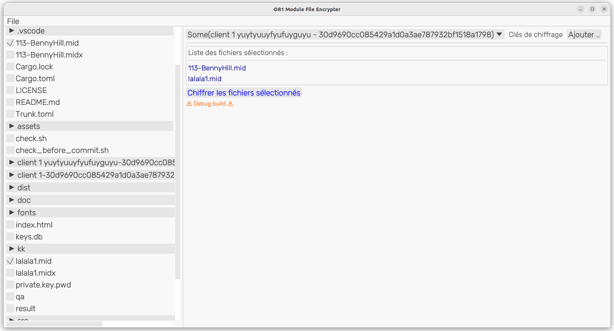

.. _cryptage:

====================================
**Encryption des oeuvres digitales**
====================================

|image0|

Le module OR1 permettant la création d’instrument de musique mécanique digitaux intègre une protection des œuvres des arrangeurs et auteurs. Cet article explique le fonctionnement du système de protection, avec les détails techniques d’implémentation.
Ces informations sont publiques, et visent à expliquer le système de protection utilisé.

Le module OR1 intègre une clef de cryptage privée, avec des éléments matériels et logiciels. Une phase d’enregistrement ( ou "enrollment") et de compilation permet de créer un logiciel spécifique pour chaque plateforme OR1, en fonction des éléments matériels.

Ainsi il est possible pour ce module OR1, d’encrypter des fichiers spécifiquement pour une carte, ne pouvant être utilisés sur d’autres matériels.

Vue générale du système de protection utilisé
---------------------------------------------

Le cryptage utilisé est asymétrique, et repose principalement sur une paire de clefs RSA (utilisé dans les systèmes bancaires, et ). Une clef permet le cryptage et une autre clef permet le décryptage.

Ainsi, un fichier décrypté (midi, ou book), peut être crypté en utilisant la **clef publique**, disponible pour tous.

Ce fichier crypté, pourra être décodé uniquement avec la clef privée.

On peut voir le processus sur le schéma ci dessous :

|image1|

plus d’information sur le cryptage, dans l’article ci joint :
https://cryptobook.nakov.com/asymmetric-key-ciphers/the-rsa-cryptosystem-concepts

La clefs privée est générée à la déclaration du module et est compilée en partie dans le logiciel. Cette clef n’est pas directement accessible, et dépends du matériel (protection sur la lecture de la clef privée).

Les fichiers midi sont décryptés en mémoire lors de la lecture du fichier, le module ne stocke pas de version décryptée, la lecture est réalisée en flux.

Utilisation du cryptage par les arrangeurs
------------------------------------------

Dans le cadre de l’utilisation du module OR1, les auteurs de fichiers midi ont un accès à la clef publique de cryptage, leur permettant de pouvoir crypter les fichiers, sans donner accès aux fichiers midi. (les fichiers midi et leur contenu reste sur l’ordinateur de l’arrangeur).

Un logiciel de cryptage est proposé pour permettre le cryptage des fichiers pour une carte OR1. Ce logiciel permet :

   - la récupération de la clef publique d’un instrument, pour le cryptage
   - la sélection d’un ou plusieurs fichiers midi
   - la création d’un répertoire contenant les fichiers encryptés

   Copie d'écran du logiciel d'encryptage

Ajout d’une nouvelle clef publique dans le logiciel
---------------------------------------------------

La récupération de la clef publique d’un module OR1 est réalisée en
quelque secondes à partir du numéro du module.

   - en appuyant sur le bouton « Ajouter »

|image2|

Une fenêtre de saisie apparaît, pour y saisir le n° du module.

|image3|

On entre la clef matérielle du module (SHA1 clé), on indique également un libellé propre à la clé pour simplifier l’utilisation.

En appuyant sur « Ajouter », le logiciel récupère la clef publique stockée sur un site de référence, et qui est insérée dans une base de donnée locale au logiciel.

**Nota \:** si la clef est disponible sous forme de fichier, il est possible de l’ajouter manuellement dans le logiciel en utilisant un client SQLite.

La nouvelle clé apparaît alors dans le choix de clef et peut être utilisée pour le cryptage des fichiers.

|image4|

Cryptage de fichiers
^^^^^^^^^^^^^^^^^^^^

Une fois la clé publique ajoutée, il est possible de la sélectionnée, puis de sélectionner sur le volet gauche du logiciel les fichiers à crypter pour ce module.

|image5|

Le panneau central récapitule alors la liste des fichiers sélectionnés, et propose un bouton « Chiffrer les fichier sélectionnés » pour crypter les fichiers.

|image6|

Une fois le cryptage réalisé, un message informe du succès de l’opération de cryptage

|image7|

Les fichiers cryptés résultants sont créés dans un répertoire spécifique, associé à la clé et reprenant le libellé et le n° du module

|image8|

On note le « x » à la fin du fichier mentionnant que le fichier est crypté, et non utilisable en dehors du module.

Ces fichiers peuvent être alors transmis sur une clef USB ou par mail, pour utilisation dans le module OR1.

FAQ : Questions fréquentes sur le cryptage
------------------------------------------

Q : Je suis arrangeur, est ce que mes fichiers midi sortent de mon ordinateur pour être utilisés sur le module OR1 ?

R : non, l’utilisation du programme d’encryptage est local à la machine de l’arrangeur et les fichiers ne sont pas envoyés.

Q : Je suis arrangeur, comment puis-je vérifier le fonctionnement du cryptage sur le module OR1 du client ?

R : Vous ne pouvez pas directement, la clef privée est propre au module, et vous ne pouvez pas la récupérer, si vous n’êtes pas confiant du principe, vous pouvez faire un essai en direct avec la personne en présence, sur son module OR1.

Q : Qu’est ce qui garantit que quelqu’un ne piratera pas le système ?

R : La sécurité informatique repose sur une notion de « temps de décryptage », notamment pour le cassage des clefs ou cracking du programme. Donc il n’y a pas de sécurité absolue, toute l’informatique repose sur ce principe. Néanmoins, il est utilisé ici des systèmes standard de cryptage, implémentés par des professionnels, permettant d’assurer que la personne ayant un fichier midx, mettra des années à récupérer le contenu en dehors du module OR1

Q : est-ce que les fichiers décryptés peuvent être envoyés sur une sortie midi ?

R : non, les fichiers encryptés midi, ne peuvent pas être envoyés sur une prise midi. La synthèse et la génération du son est directement faite pas le module et envoyée sur la sortie sonore. Il est possible de faire une reconnaissance IA, cependant l’attaquant perd une partie des informations (timing, tempo, paroles, .. )

.. |image0| image:: encryption/Pictures/1000000000000DB000000920FE38D167A96FDA3C.jpg
   :width: 8.507cm
   :height: 5.671cm

.. |image8| image:: encryption/Pictures/10000001000002120000006E7CF6B30C7CC885CA.png
   :width: 14.023cm
   :height: 2.91cm
