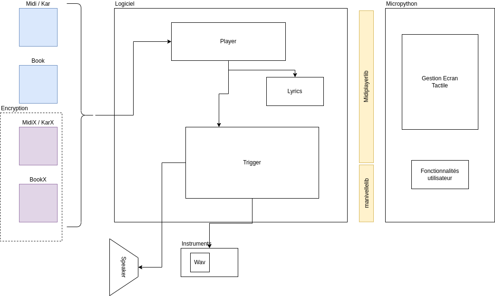

===
SDK
===

Le SDK propose les informations nécessaires pour créer des logiciels utilisant le module OR1, ou adapter les fonctionnalités du logiciel existant.

Organisation logicielle générale
--------------------------------

La partie logicielle du module OR1 comprends les éléments suivants:

    - un système linux avec les différents drivers matériels
    - un interpreteur micropython, compilé spécifiquement pour cette plateforme
    - une bibliothèque libmidiplayer, exposée sur l'interpreteur micropython

Cette organisation est représentée comme ci dessous :

La partie logicielle est au centre du fonctionnement du module, cette partie implémentée en C/C++/rust fourni l'ensemble des fonctions nécessaires à la création d'écran et la partie sonore.

Cette partie est exposée à l'interpreteur python pour l'orchestration. 

Plusieurs composants sont présents dans le logiciel : le module `trigger` réalisant la synthèse sonore à partir des fichiers wav, permettant de mixer au rythme souhaité, les différentes voies, avec les registres et récalages sonores. 
Un composant `player` prenant en charge la lecture des fichiers, l'envoi des notes au trigger, la gestion du temps et tempo.

.. include:: api_micropython.rst

.. include:: api_c.rst

