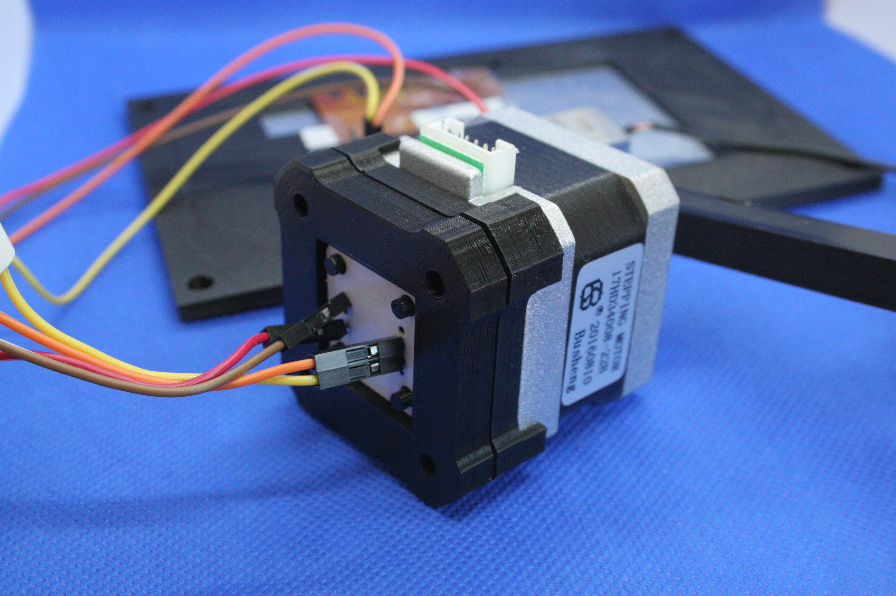

=======
Annexes
=======

Caractéristiques Techniques détaillées
--------------------------------------

Caractéristiques sonores

   - Restitution en qualité CD ( 44,1 Khz, 16 bits, Stéréo )
   - Polyphonie : plus de 20 voies jouées simultanément
   - Le Volume est fixé en sortie de la carte, une possibilité d’ajouter un ampli audio, pour augmenter le volume ou ajuster et la balance des aiguës et des graves.

Electrique / Connexions :

   - Alimentation 5V par connexion sur la carte (régulé), ou prise USB 
   - 200 mA de consommation courant (Avec écran), hors amplification
   - Prise Jack 3.5mm pour sortie amplificateur

Caractéristiques du Processeur central :

+---------------------------------+-----------------------------------+
|                                 |                                   |
+---------------------------------+-----------------------------------+
| **SoC**                         | Allwinner V3S                     |
+---------------------------------+-----------------------------------+
| **Processeur**                  | ARM Cortex-A7                     |
+---------------------------------+-----------------------------------+
| **Fréquence de fonctionnement** | 1.2GHz                            |
+---------------------------------+-----------------------------------+
| **RAM**                         | 64MB DDR2                         |
+---------------------------------+-----------------------------------+
| **Stockage**                    | Flash SPI/Micro SD                |
+---------------------------------+-----------------------------------+
|                                 | \* FPC LCD RVB 40P universel :    |
|                                 |                                   |
|                                 | \* Résolutions prises en charge : |
|                                 | 272 × 480, 480 × 800,1024, 600 ×  |
|                                 | XNUMX                             |
|                                 |                                   |
|                                 | \* Puce RTP embarquée, prend en   |
|                                 | charge un écran tactile           |
+---------------------------------+-----------------------------------+
|                                 | \*SDIO x2                         |
|                                 | \* SPI x1                         |
|                                 | \* I2C x2                         |
|                                 | \* UARTx3                         |
|                                 | \* 100M Ether x1 (inclut EPHY)    |
|                                 | \* USB OTG x1                     |
|                                 | \* MIPI CSI x1                    |
|                                 | \* PWM x2                         |
|                                 | \* LRADC x1                       |
|                                 | \* Haut-parleurx2 + Micro x1      |
+---------------------------------+-----------------------------------+
|                                 | Micro USB 5 V, broches 2.54 mm    |
|                                 | Alimentation 3.3 V ~ 5 V ;        |
|                                 | Alimentation de trou de timbre de |
|                                 | 1.27 mm.                          |
|                                 |                                   |
|                                 | 1 GHz linux IDLE fonctionne 90 ~  |
|                                 | 100 mA ; cpu-burn run ~180mA      |
|                                 |                                   |
|                                 | Température de stockage -40 ~ 125 |
|                                 |                                   |
|                                 | Température de fonctionnement -20 |
|                                 | ~ 70                              |
+---------------------------------+-----------------------------------+

Dimensions – Encombrement
-------------------------

Support écran + Carte CPU
^^^^^^^^^^^^^^^^^^^^^^^^^

Pièce 3D support, facilitant la fixation de l’écran sur l’instrument

   Support 3D de l'écran

   Dimensions du support 3D Ecran

Pièce additionelle pour la fixation de la carte mère derrière l’écran

   Support 3D de fixation de la carte CPU

Dimensions fixation manivelle
^^^^^^^^^^^^^^^^^^^^^^^^^^^^^

|image20|

   Dimension support de manivelle

   Dimension Moteur NEMA Standard

Connexions électroniques 
^^^^^^^^^^^^^^^^^^^^^^^^

La carte principal est connectée aux différents élément comme suit :

La connexion SDA/SCL/3V et GND est en liaison avec le capteur de rotation de la manivelle.

La connexion Vin / GND est soudée sur l'alimentation

.. warning::
    Attention, à ne pas dépasser 5V pour l'alimentation, même si la carte possède un regulateur, celui ci ne pourra dissiper un large différence de tension. Le module peut être déterioré avec une mauvaise alimentation.

|image21|

|image22|

