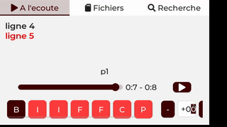

==============================================
Utilisation des paroles dans les fichiers MIDI
==============================================

Le module OR1 propose un affichage des paroles pouvant être insérés dans les fichiers midi. Ces paroles sont enregistrées dans le fichier midi, avec des timings d'affichage pour faire du karaoke, ou apprendre les paroles d'une chanson.
Nous regardons ici les différentes méthodes pour ajouter les paroles dans le fichier midi.

Plusieures méthodes existent dans l'encodage des paroles au sein des fichiers MIDI, et cette rubrique vise à donner plus de détails sur l'utilisation et la mise en place dans un fichier Midi, avec le minimum d'outillage pour le module OR1.

.. :warning:: 
    Les fichiers midi sont des fichiers binaires, et ne sont pas directement éditables avec un éditeur de texte. Il est nécessaire d'utiliser un programme spécifique pour éditer les fichiers midi.

Encodage des paroles pour les fichiers midi
-------------------------------------------

Tout comme les évènements "note" dans les fichiers MIDI, des évènements de type "texte" peuvent également y être insérés. Ces évènements sont utilisés dans les fichier .kar pour le karaoké.

Deux type d'évènements de type texte sont disponibles dans la norme midi, OR1 n'exploite que les évènements de type "Lyric". Les évènement "Text" sont ignorés.

Les textes dans les évènements Lyric son encodés en utilisant le character set "ISO-8859-1" (iso latin). Cet encodage est celui utilisé par défaut en europe. Si l'encodage n'est pas correctement utilisé, les accents peuvent ne pas s'afficher correctement sur le module.

Lecture et utilisation des évènements TEXT Midi, dans le Module OR1
--------------------------------------------------------

Lors de l'ouverture d'un fichier midi, OR1 effectue deux lectures du fichier.
La première lecture extrait les évènements texte et reconstitue des lignes de texte.

Ces lignes sont créée avec le contenu du  texte des évènements, et sont découpées en utilisant le caractère de retour chariot ("\n") ou line feed ("\c") à la fin de l'évènement.

ATTENTION, si un évènement texte contient plusieures lignes, uniquement la fin de ligne est évaluée pour le découpage en ligne.

Modification du midi pour insérer les paroles
^^^^^^^^^^^^^^^^^^^^^^^^^^^^^^^^^^^^^^^^^^^^^

Il est possible de mettre les paroles dans un fichier midi, en utilisant différents programmes. Ici dans un but illustratif, le programme https://github.com/pietvo/midi2text est utilisé. Celui ci converti au format texte les évènements midi encodés dans un fichier .mid.

.. :note::
    Pour la création de nombreux fichiers midi, il est possible d'utiliser le logiciel MidiSwing, qui permet de créer des fichiers midi, et d'insérer les paroles dans les évènements midi. 

exemple : 

::

    mf2t p1.mid > p1.txt 

le resultat de l'opération de transcription du fichier midi en texte est le suivant :

::

    MFile 0 1 480
    MTrk
    0 Tempo 500000
    0 Meta Text "created with MidiSwing"
    488 On ch=1 n=72 v=100
    968 Off ch=1 n=72 v=100
    1475 On ch=1 n=73 v=100
    1955 Off ch=1 n=73 v=100
    2413 On ch=1 n=74 v=100
    2893 Off ch=1 n=74 v=100
    3363 On ch=1 n=75 v=100
    3843 Off ch=1 n=75 v=100
    4313 On ch=1 n=76 v=100
    4793 Off ch=1 n=76 v=100
    5300 On ch=1 n=77 v=100
    5780 Off ch=1 n=77 v=100
    6263 On ch=1 n=78 v=100
    6743 Off ch=1 n=78 v=100
    7225 On ch=1 n=79 v=100
    7705 Off ch=1 n=79 v=100
    7705 Meta TrkEnd
    TrkEnd

Il est remarqué dans le resultat qu'il n'y a aucun évènement de type `Meta Lyric`, 
En ajoutant nouvellement ces éléments, avec les bons timings, nous pouvons ajouter les paroles :

::

    MFile 0 1 480
    MTrk
    0 Tempo 500000
    0 Meta Text "created with MidiSwing"
    488 On ch=1 n=72 v=100
    968 Off ch=1 n=72 v=100
    968 Meta Lyric "ligne 1\r"
    1475 On ch=1 n=73 v=100
    1955 Off ch=1 n=73 v=100
    2413 On ch=1 n=74 v=100
    2893 Off ch=1 n=74 v=100
    2893 Meta Lyric "ligne 2\r"
    3363 On ch=1 n=75 v=100
    3843 Off ch=1 n=75 v=100
    4313 On ch=1 n=76 v=100
    4793 Off ch=1 n=76 v=100
    4793 Meta Lyric "ligne 3\r"
    5300 On ch=1 n=77 v=100
    5780 Off ch=1 n=77 v=100
    5780 Meta Lyric "ligne 4\r" 
    6263 On ch=1 n=78 v=100
    6743 Off ch=1 n=78 v=100
    6743 Meta Lyric "ligne 5\r" 
    7225 On ch=1 n=79 v=100
    7705 Off ch=1 n=79 v=100
    7705 Meta TrkEnd
    TrkEnd

Puis, reconvertir le fichier texte en fichier midi :

::
    
    t2mf p1.txt > p1.mid

Une fois ouvert avec le module nous obtenons le resultat, suivant  : 

    Module affichage les paroles nouvellement insérées dans le fichier midi

