Présentation du module OR1
=============================

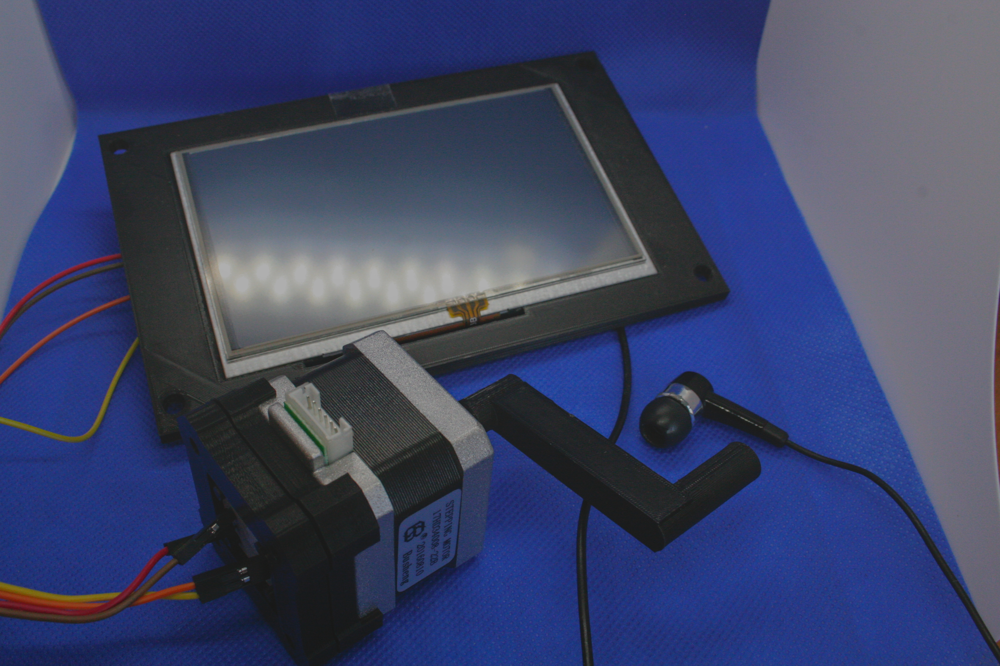

   Ensemble OR1, écran + carte électronique pour la mise en place d’instruments,
   pilotable par manivelle. Intégrable dans un boîtier de type Orgue,
   Serinette, ou Boîte à musique.

Fonctionnalités du module
-------------------------

Les fonctionnalités du module sont décrites ci dessous, pour la version 1 du module.

Lecture de fichiers interactive
^^^^^^^^^^^^^^^^^^^^^^^^^^^^^^^

- Lecture numérique de fichiers « Midi », « Kar » ou « Book », (les deux formats sont proposés)

- Lecture numérique de fichiers « BookX », « MidiX », crypté fournis par les arrangeurs

- Vitesse de jeu du fichier pilotée par la rotation de la manivelle, ou selection d’un tempo (jeu automatique)

- Choix d’instrument dans une bibliothèque (Anche, Flute, ...)

- Lecture du fichier , en automatique sans tourner la manivelle

- Restitution sonore paramétrable (par fichiers, pour la personnalité de l’instrument) :

- possibilité de changement de registres de l'instrument en cours de jeu

- possibilité de changement d’instrument parmi une bibliothèque proposée

- Suivi dans la progression du jeu. (l’utilisateur a les informations de chronométrage du jeu et de la durée du morceau de musique en cours).

- Affichage des paroles sur 4 lignes, pendant le jeu.

- Ajout de fichiers midi sur la carte principale, en utilisant un ordinateur, pour étendre sa propre bibliothèques de titres. Jeu à partir de fichier stockés sur une clef USB.

Système de protection de fichiers arrangés ou achetés (DRM)
^^^^^^^^^^^^^^^^^^^^^^^^^^^^^^^^^^^^^^^^^^^^^^^^^^^^^^^^^^^

En complément de l’utilisation des fichiers au format MIDI, KAR ou BOOK, utilisables directement sur le module.

Ce module intègre également l'utilisation de fichiers cryptés fournis par un tier (arrangeur, auteurs). Les format d'origine, sont encryptés avec un suffix "X" (MidiX, KarX, BookX) et ne seront utilisable que sur un module donné.
Ce format de fichier permettant aux arrangeurs de proposer leur travail, utilisable directement sur le module, sans donner accès au fichier d'origine.

.. note:: le cryptage utilisé intègre un cryptage asymétrique RSA, ce cryptage est utilisé actuellement dans les communications cryptées sur internet et également par le système bancaire.

Plus d'information dans la section "cryptage" :doc:`../encryption`

Sons paramétrables
^^^^^^^^^^^^^^^^^^

Conception et paramétrages d’instruments pour le module, en utilisant :

- des échantillons sonores au format WAV (16 bits / Stereo / 44,1Khz)

- des banques de sons utilisables au format sf2 (via outils) (version logicielle 1.1 du module)

plus d'informations dans la section :doc:`../createinstrument`

Kit de développement du module
^^^^^^^^^^^^^^^^^^^^^^^^^^^^^^

Pour les utilisateurs ayant des compétences de développement, ou en informatique, le module peut être livré avec des outillages de développement d’applications, permettant d’ajuster et modifier les écrans et les fonctionnalités associées.

**Fonctions avancées (disponibilité d’outils de personnalisation avancée, pour paramétrer les diverses actions et fonctions offertes à l’utilisateur)**

- un exemple complet d’application de démonstration est fourni avec le module (pour permettre, aux intégrateurs de comprendre et construire leurs écrans).

- la possibilité de changer la banque sonore en fonction des l’effet désiré.

- utilisation du langage Python (micropython) pour la personnalisation.

Conception des fonctions et écrans en utilisant le langage python

Le module propose un interpréteur python intégrant les fonctions nécessaire à la création d’écran, de pilotage, et catalogage.

Le toolkit intègre également une bibliothèque graphique reconnue, permettant la création d’écran tactiles, permettant l’adaptation, ou la création d’une nouvelle application.

Cette capacité est proposée dans la version SDK / Facteur Orgue, et accompagnée des différents outils nécessaires pour la mise en place de programmes sur la plateforme.

Applications possibles du module
--------------------------------

- Instrument mécanique électronique

- Pupitre de pilotage d'un instrument midifié

Première utilisation du module
------------------------------

Cette section présente rapidement ici, les fonctionnalités principale et le fonctionnement des 3 écrans. Cette introduction permet de démarrer rapidement dans la compréhension du module et ses fonctions principales.

Lorsqu’activé, initialement, le module propose trois écrans :

- un écran d’écoute et manipulation du jeu

- un écran de choix de fichiers

- un écran de recherche de fichier

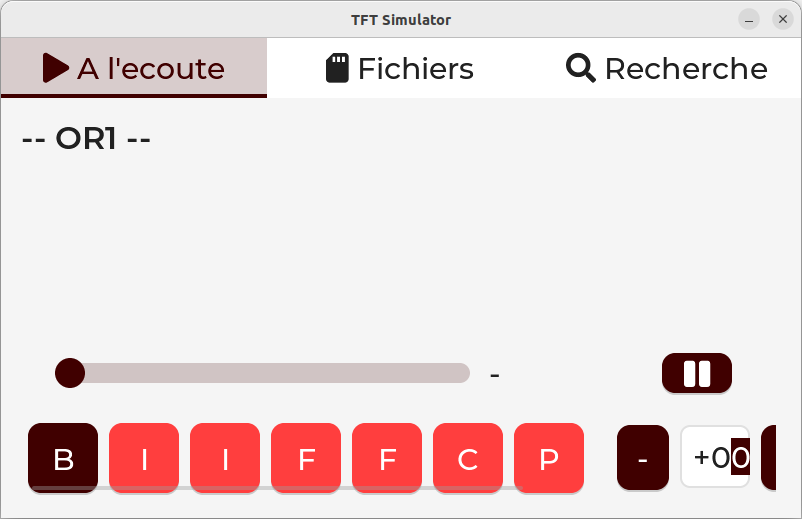

   Ecran de jeu

   Ecran de sélection de fichiers

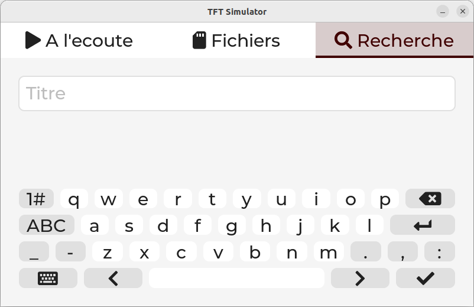

   Ecran de recherche d'un fichier

Les trois écrans sont accessibles par pression tactile sur la dalle d'affichage, dans la zone supérieure de l'écran.

Jouer un fichier midi
^^^^^^^^^^^^^^^^^^^^^

Aller dans l’écran fichier :

|image1|

Avec les flèches situées sur la gauche de l’écran, il est possible de se déplacer dans la liste.

Lorsque le fichier est sélectionné, il est possible d’appuyer sur le bouton « play » pour lancer la lecture du fichiers. Le module bascule alors sur l’écran de jeu de fichier.

|image2|

Le morceau est alors joué, des boutons situés en bas de l’écran permettent de changer l’instrument en cours de route.

Un control permet de transposer le jeu du morceau (+- 12 demis tons), permettant d’ajuster la hauteur de chant (plus haut ou plus bas).

|image3|

Note : certains fichiers contiennent des paroles, les paroles sont alors affichées en haut de l’écran.

|image4|

Sélectionner un fichier sur la clef USB
^^^^^^^^^^^^^^^^^^^^^^^^^^^^^^^^^^^^^^^

Dans le 2eme ecran, l’utilisateur peut sélectionner un fichier sur sa clef USB. L’écran permet de sélectionner un fichier, entrer dans un répertoire, remonter d’un répertoire.

|image5|

Les boutons proposent les actions suivantes :

Montée rapide ou descente rapide dans la liste des fichiers

|image6|

Fonctions de navigation dans les répertoire + jeu du fichier.

|image7|

Étapes de mise en route de la carte (paramétrage) :
^^^^^^^^^^^^^^^^^^^^^^^^^^^^^^^^^^^^^^^^^^^^^^^^^^^

Insérez la carte SD, dans l’emplacement dédié sur la carte mère. Cette carte SD contient un logiciel conçu pour les cartes :

Connectez le matériel :

- alimentation (5V)

- manivelle (I2C, SDA, SCL, GND + 3.3V)

- sortie Ampli (prise jack)

à la première mise sous tension, l’écran suivant apparaît :

|image8|

Sur du matériel inconnu, cet écran apparaît car le programme n’a pas été autorisé. L’autorisation est réalisée une seule fois dans la vie du module. Cette autorisation permet également de référencer le module pour
les arrangeurs, pouvant crypter les fichiers pour ce module.

Avec un téléphone portable , il est alors possible de scanner le QR code pour envoyer une demande par mail. Une fois le mail envoyé, le programme est alors compilé spécifiquement et mis en place sur une plateforme
d’échange.

Lorsque l’accusé réception de la création du programme est réalisé, une manipulation est nécessaire sur le module pour permettre sa réception.

La réception du programme est réalisée par le cable ethernet (sur la carte).

Le branchement sur internet se fait sur par un cable reseau connecté à une box internet.

Une fois celle ci branchée sur le module, il faut procéder comme suit:

- Eteindre et allumer le module

- Lorsque l’écran apparaît, il faut appuyer sur le bouton « Recuperer le fichier automatiquement ».

- Quelques secondes plus tard l’écran principal est affichées

L’opération réalisée avec succès ne sera plus effectuée au redémarrage du matériel.

|image9|

Électronique et matériel
------------------------

Le module se présente en différents composants , une carte électronique, un écran, et une carte encodeuse de rotation montée sur un moteur pas à pas (pour le guidage mécanique).

|image10|

Ecran tactile , 5 pouces (13 cm en diagonale), Résolution : 800 x 480.

|image11|

|image12|\ |image13|\ |image14|

Module manivelle
^^^^^^^^^^^^^^^^

Le module manivelle proposé est construit sur un moteur NEMA, proposant une simplification mécanisque du guidage de la manivelle.

Ce module , en fonction des besoins, peut être remplacé par un autre système, proposant la connexion avec l’encodeur de gestion de la rotation et de l’avancement du jeu musical.

Ci dessous une illustration du module proposé :

|image15|

|image16|

Encodeur magnétique , utilisant une liaison **sans contacts**, et intégrant 4096 incréments par tours. Guidage par roulements, intégré dans le moteur NEMA

Ci dessous, le détail de la pièce de fixation de l’encodeur sur le moteur (position arrière, avec l’aimant)

|image17|

Illustration d’une manivelle fixée sur l’arbre moteur, d’un diamètre de 5 mm.

|image18|

Connectique et **intégration**
------------------------------

Ci dessous un exemple de mise en œuvre dans un instrument :

|image19|

Vous trouverez plus de détails dans la rubrique Dimension et Encombrement située en annexe.

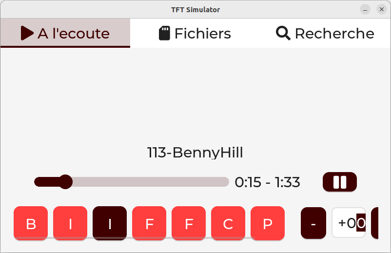
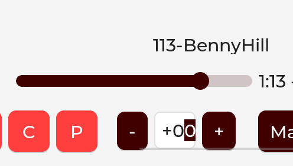
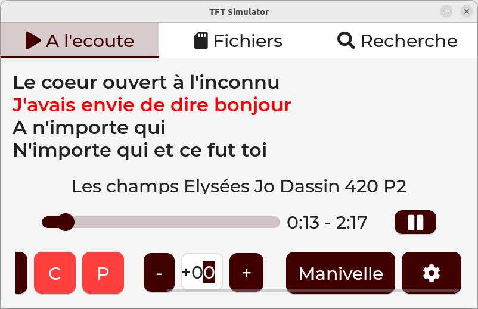

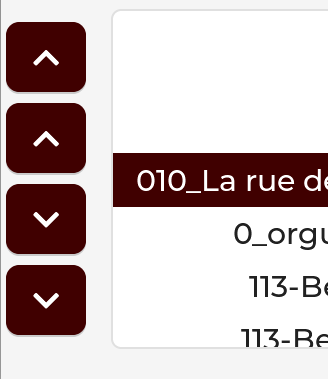
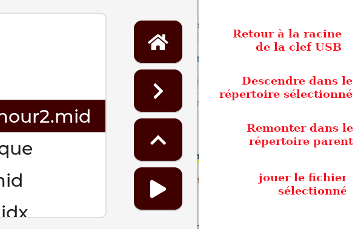
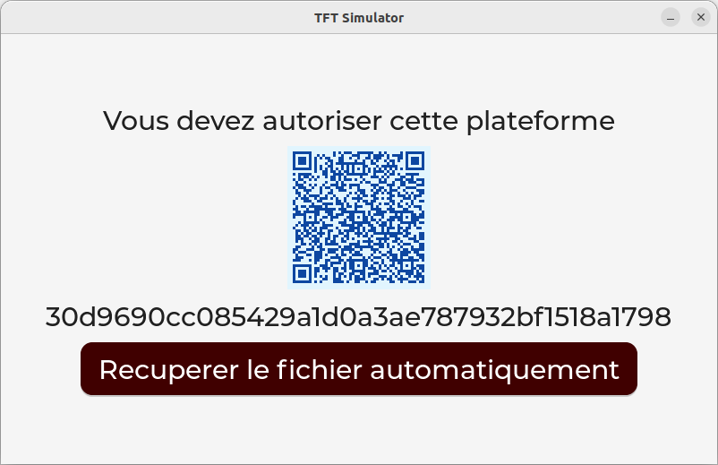
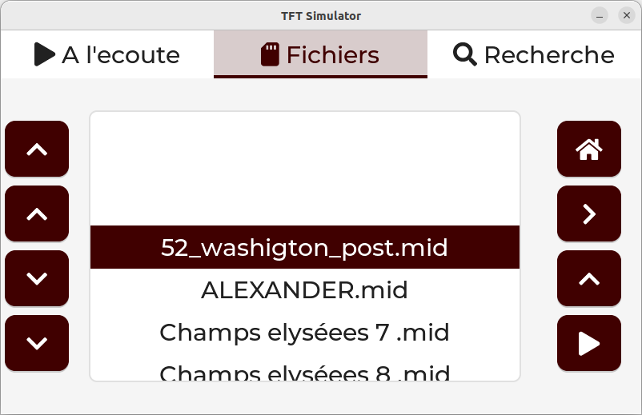
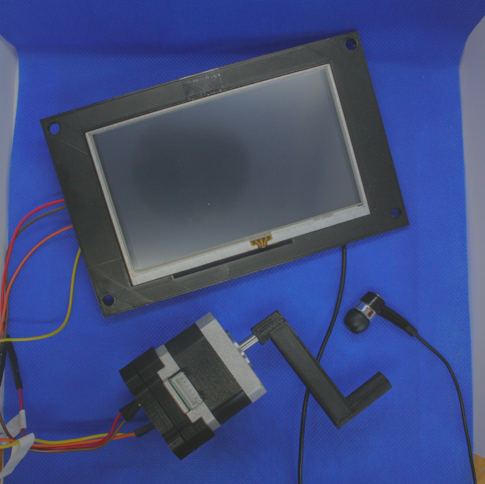
.. |image11| image:: utilisation/Pictures/1000000000000DB000000920699F02F360E6A103.jpg
   :width: 10.613cm
   :height: 7.075cm
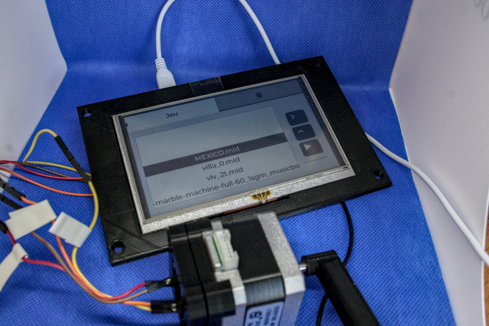
.. |image13| image:: utilisation/Pictures/1000000000000DB00000092006821CFDB26F378D.jpg
   :width: 5.507cm
   :height: 3.671cm
.. |image14| image:: utilisation/Pictures/1000000000000DB000000920699F02F360E6A103.jpg
   :width: 5.618cm
   :height: 3.745cm
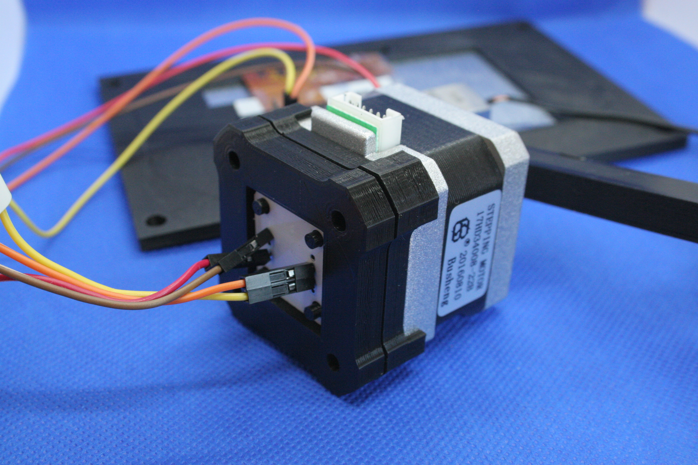
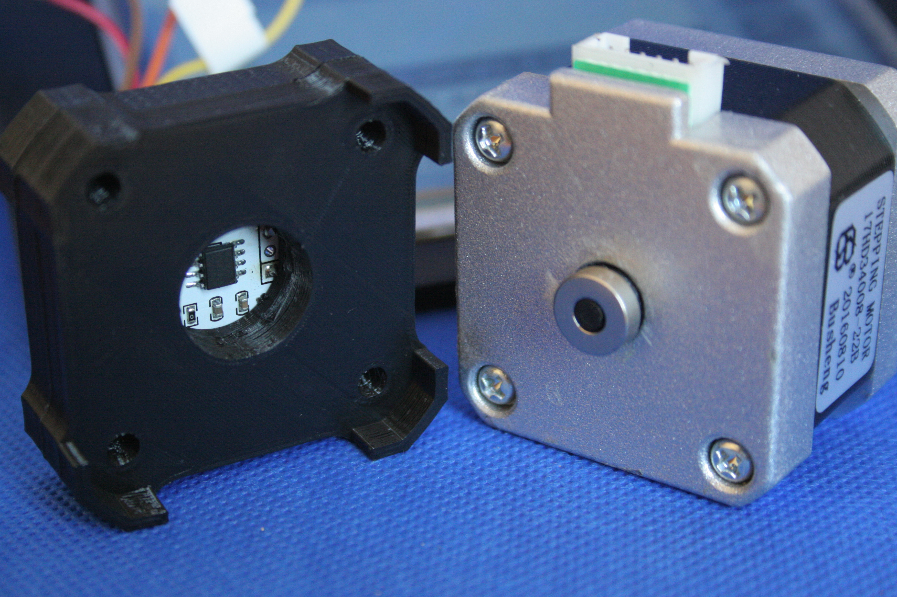
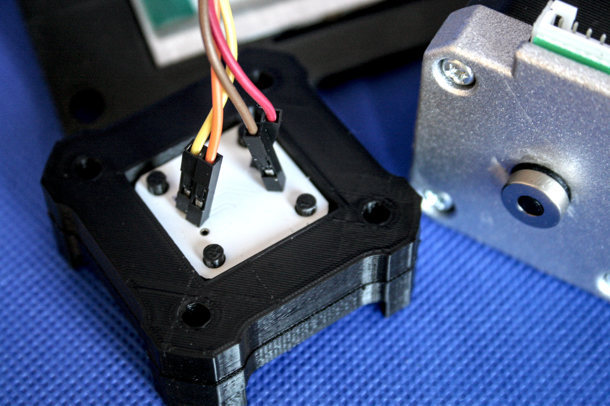
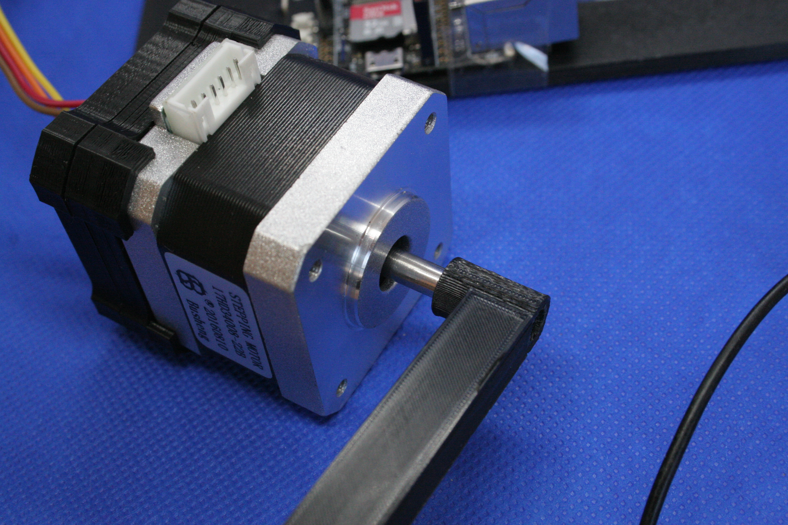
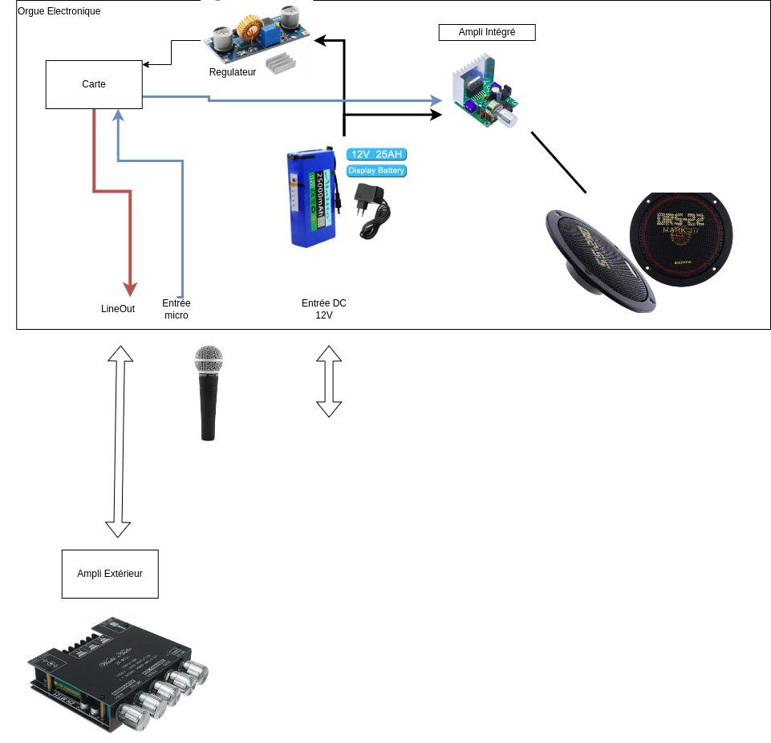